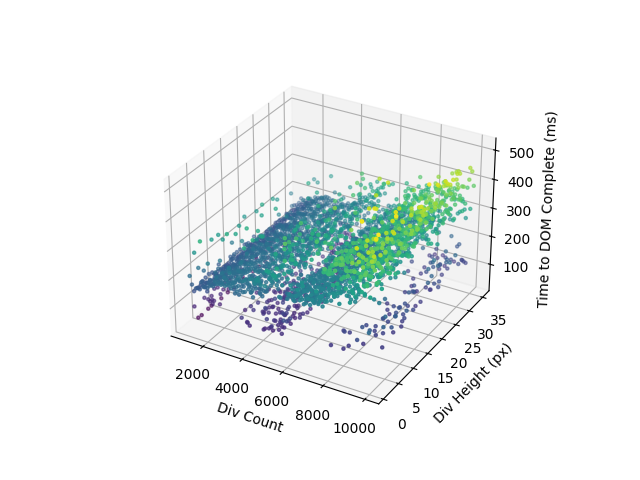

<h1 align="center">
    How Many Divs?
</h1>

  

# Purpose

This project is a stepping stone project that explores the limit of modernday rendering.
More specifically, how many divs can a browser handle for the purposes of rendering file text.
I'd like to explore the idea of an IDE within a browser, but I'm jaded by a past experience.
Once upon a time, I sought out to make a spreadsheets clone within a browser, but quickly found the need for a clever rendering scheme for it to work.
It was clear it wasn't going to be as simple as making a div for each cell.
It occured to me that I had never made reference to how Google implemented spreadsheets in a browser.
Checking it would reveal, the canvas element, and thus brings us back to my delima.
Now, near the end of 2024, how many divs?

# Research

Through my research of lighthouse, it seems 1,000 - 1,500 are considered cutoffs for "ideal" DOM sizes.
Google lighthouse discusses max of 60 child nodes and max depth of 32 per branch.
This research will explore the 1k to 10k range.

# Possible Approaches

- [x] Create a python script that generates static webpages.
- [ ] Create a html + js webpage that generates the same params as above, but using javascript to create the elements after pageload.
- [ ] Create a canvas based approach that handles memory

# Implementation

`generate.py` is a python script that generates 1000 to 10000 (@100 increments; inclusive) divs, at 1 to 35 (@1 increments; inclusive) heights rendering a total of 100 * 35 = 3,500 static webpages.

`evaluate.py` is a python script that leverages the playwright library to navigate to each static webpage and pulls the javascript performance timing metrics and stores the results into the `performance-timings.pkl` file.

`analysis.py` is a python script that looks in the `performance-timings.pkl` file and creates a plot on how div counts and div heights impact render performance.

# Experimental Results

`performance-timings.pkl` contains an object following a key (URL) object (metrics object) scehma.
- connectStart
- secureConnectionStart
- unloadEventEnd
- domainLookupStart
- domainLookupEnd
- responseStart
- connectEnd
- responseEnd
- requestStart
- domLoading
- redirectStart
- loadEventEnd
- domComplete
- navigationStart
- loadEventStart
- domContentLoadedEventEnd
- unloadEventStart
- redirectEnd
- domInteractive
- fetchStart
- domContentLoadedEventStart

`results.csv` contains calculated metrics containing the independent variables.
- Div Count
- Div Height
- DNS Lookup Time
- TCP Connect Time
- Secure Connection Time
- Request Time (TTFB)
- Response Time
- Time to DOM Interactive
- Time to DOMContentLoaded
- Time to DOM Complete
- Load Event Duration
- Total Page Load Time

`3d-scatter-plot.png` the plot viewable at the top of this README.
